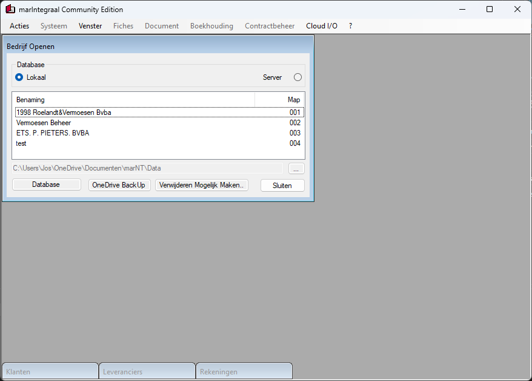

# marIntegraal

## [ClickOnce][ClickOnce]

## History

marIntegraal stands for: complete bookkeeping around the Minimum Classification General Accounting System (Belgium).

- It is a project that was first marketed for Amstrad/Schneider PCW on CP/M PLUS at the end of 1985. At the time the program was written in Mallard BASIC, one of the few fast BASIC versions that uses B-Plus tree index sorting on CP/M and MS-DOS/PC-DOS.
- For our program that will later become Open-Source, the commercialized version is available on our website vsoft.be (All our customers since 1985 can enjoy the development from then until now and ask questions. As always, our customers' data remains safe using the 'Mario' program whenever you switch to the latest development platforms
- From 2025, we will serve our customers 100% by delivering programs 'as a service'. More information will follow.
- At the moment (2024), in this Open Source version, we are having fun translating and testing the reporting functions from the commercial version. You can freely view our work in progress if you wish
- Have fun!

[ClickOnce]: https://clickonce.vsoft.be/MarIntegraal/publish.htm
